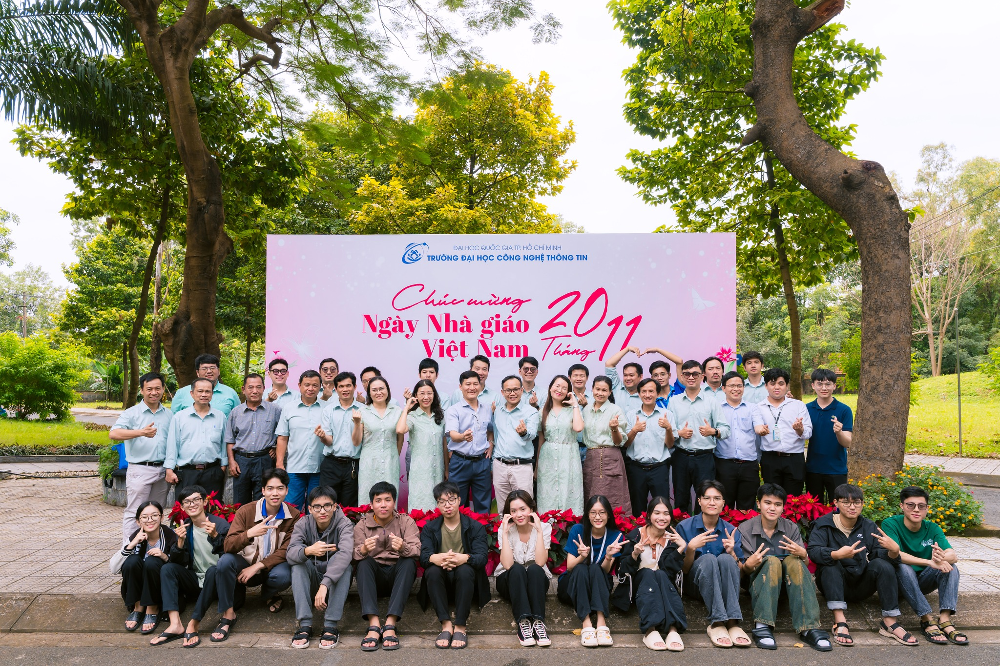
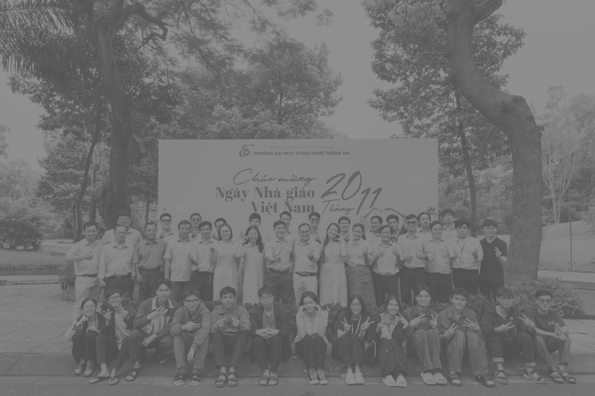

# Verilog RGB-to-Grayscale Image Converter
#Note: You should not synthesize this code because it is not designed for running on FPGA, but rather for functional verification purposes
#Using Modelsim.

This project converts a full-color RGB image into an 8-bit grayscale image using a Verilog RTL module and ModelSim/QuestaSim functional simulation.

The workflow uses Python to convert the source image into hexadecimal RGB pixels, Verilog to process one pixel per valid clock cycle, and Python to reconstruct the grayscale output image.

> **Scope:** This repository is intended for functional simulation and educational use. The file-based testbench is not synthesizable and is not designed for direct FPGA deployment.

---

## Result

| Original RGB image | Verilog grayscale output |
|---|---|
|  |  |

Current image configuration:

| Property | Value |
|---|---:|
| Width | 2048 pixels |
| Height | 1365 pixels |
| Total pixels | 2,795,520 |
| Input format | 24-bit RGB |
| Output format | 8-bit grayscale |
| Simulation clock | 100 MHz |
| RTL latency | 1 clock cycle |

---

## Processing Flow

```text
baitap2_anhgoc.jpg
        │
        ▼
baitap2_rgb_to_txt.py
        │
        ▼
baitap2_pic_input.txt
   one R G B pixel per line
        │
        ▼
Lab2_bai2.v
        │
        ▼
tb_Lab2_bai2.v
        │
        ▼
ModelSim / QuestaSim
        │
        ▼
baitap2_pic_output.txt
   one grayscale value per line
        │
        ▼
baitap2_txt_to_gray.py
        │
        ▼
baitap2_grayscale.jpg
```

---

## Grayscale Conversion

The intended grayscale equation is:

```text
Y = 0.299R + 0.587G + 0.114B
```

The RTL replaces floating-point multiplication with fixed-point integer coefficients:

```text
Y ≈ (77R + 150G + 29B + 128) / 256
```

The coefficients add up to 256:

```text
77 + 150 + 29 = 256
```

This allows division by 256 to be implemented as a bit shift rather than a hardware divider.

### Brightness control

In the current main implementation, `brightness` is an unsigned value added directly to the grayscale result:

```text
gray_final = clamp(gray_base + brightness, 0, 255)
```

Examples:

```text
brightness = 0    → no additional brightness
brightness = 40   → add 40 to every grayscale pixel
brightness = 80   → add 80 to every grayscale pixel
```

Values greater than 255 are saturated to 255.

The brightness value used for full-image simulation is configured in `tb_Lab2_bai2.v`:

```verilog
brightness = 8'd80;
```

---

## Repository Structure

```text
Verilog-RGB-to-Grayscale/
├── Lab2_bai2.v
├── tb_Lab2_bai2.v
├── Lab2_Bai2_test.v
├── TB_Lab2_Bai2_test.v
├── baitap2_rgb_to_txt.py
├── baitap2_txt_to_gray.py
├── baitap2_anhgoc.jpg
├── baitap2_grayscale.jpg
├── requirements.txt
├── .gitignore
└── README.md
```

### Main files

| File | Description |
|---|---|
| `Lab2_bai2.v` | Main RGB-to-grayscale RTL module |
| `tb_Lab2_bai2.v` | Full-image file-based testbench |
| `baitap2_rgb_to_txt.py` | Converts the RGB image into hexadecimal pixel data |
| `baitap2_txt_to_gray.py` | Reconstructs the grayscale image from simulator output |
| `baitap2_anhgoc.jpg` | Original RGB source image |
| `baitap2_grayscale.jpg` | Reconstructed grayscale result |

The files ending in `_test.v` are separate verification/reference versions. Do not compile them together with the main implementation because both sets declare the same module names.

---

## Requirements

### Software

- Python 3.9 or later
- ModelSim, QuestaSim, or ModelSim Intel FPGA Edition
- Git, if cloning the repository

### Python packages

```text
numpy
Pillow
opencv-python
```

Install them with:

```powershell
python -m pip install numpy Pillow opencv-python
```

---

## Clone the Repository

```powershell
git clone https://github.com/lmnghiapy/Verilog-RGB-to-Grayscale.git
cd Verilog-RGB-to-Grayscale
```

You may also download the repository as a ZIP file:

```text
GitHub repository → Code → Download ZIP
```

Extract the ZIP and open PowerShell inside the extracted directory.

---

# Running the Project on Windows

## Step 1 — Open the project directory

Example:

```powershell
cd D:\Lab2\Lab2\Lab2_Bai2
```

Check the current directory:

```powershell
pwd
```

List the files:

```powershell
Get-ChildItem
```

---

## Step 2 — Create a Python virtual environment

```powershell
python -m venv .venv
```

Activate it:

```powershell
.\.venv\Scripts\Activate.ps1
```

If PowerShell blocks the activation script:

```powershell
Set-ExecutionPolicy -Scope CurrentUser RemoteSigned
```

Then activate the environment again:

```powershell
.\.venv\Scripts\Activate.ps1
```

Install the dependencies:

```powershell
python -m pip install --upgrade pip
pip install numpy Pillow opencv-python
```

---

## Step 3 — Use relative paths in the testbench

Open the full-image testbench:

```powershell
notepad tb_Lab2_bai2.v
```

Find the two `$fopen` statements.

If they contain absolute paths such as:

```verilog
f_in  = $fopen("D:/Lab2/Lab2/Lab2_Bai2/baitap2_pic_input.txt", "r");
f_out = $fopen("D:/Lab2/Lab2/Lab2_Bai2/baitap2_pic_output.txt", "w");
```

replace them with relative paths:

```verilog
f_in  = $fopen("baitap2_pic_input.txt", "r");
f_out = $fopen("baitap2_pic_output.txt", "w");
```

Save the file.

Relative paths allow the project to run after being cloned into any directory.

---

## Step 4 — Generate RGB hexadecimal input data

The input image must be named:

```text
baitap2_anhgoc.jpg
```

Run:

```powershell
python baitap2_rgb_to_txt.py
```

Expected output:

```text
Tong so pixel: 2795520
Kich thuoc anh: (2048, 1365)
```

The script creates:

```text
baitap2_pic_input.txt
```

Each line contains one RGB pixel:

```text
R G B
```

Example:

```text
82 a5 b8
d2 ec fd
cd cf e4
```

---

## Step 5 — Compile the Verilog files

Check whether ModelSim is available from the terminal:

```powershell
vsim -version
```

Create a clean simulation library:

```powershell
if (Test-Path work) {
    Remove-Item -Recurse -Force work
}

vlib work
```

Compile the main RTL and full-image testbench:

```powershell
vlog Lab2_bai2.v tb_Lab2_bai2.v
```

The top-level testbench module is:

```text
tb_image_to_grayscale
```

---

## Step 6 — Run the simulation

Run ModelSim in command-line mode:

```powershell
vsim -c tb_image_to_grayscale -do "run -all; quit -f"
```

Expected transcript messages include:

```text
--- BAT DAU XU LY ANH ---
--- DA XONG. KIEM TRA FILE 'baitap2_pic_output.txt' ---
```

The simulation creates:

```text
baitap2_pic_output.txt
```

Each line contains one 8-bit grayscale value in hexadecimal format:

```text
77
89
84
84
86
```

Because the image contains 2,795,520 pixels, the simulation may take some time depending on the computer and simulator version.

---

## Step 7 — Reconstruct the grayscale image

Run:

```powershell
python baitap2_txt_to_gray.py
```

Expected output is similar to:

```text
Doc duoc   : 2795520 gia tri
Can thiet  : 2795520 pixels (2048x1365)
Da luu anh : baitap2_grayscale.jpg
```

The reconstructed image is saved as:

```text
baitap2_grayscale.jpg
```

---

## Complete Command Sequence

After completing the one-time path correction in `tb_Lab2_bai2.v`, the complete workflow is:

```powershell
python baitap2_rgb_to_txt.py

if (Test-Path work) {
    Remove-Item -Recurse -Force work
}

vlib work
vlog Lab2_bai2.v tb_Lab2_bai2.v
vsim -c tb_image_to_grayscale -do "run -all; quit -f"

python baitap2_txt_to_gray.py
```

---

# Running with the ModelSim GUI

If `vsim` is not available in PowerShell:

1. Open ModelSim or QuestaSim.
2. Select **File → Change Directory**.
3. Choose the repository directory.
4. In the Transcript window, create the library:

```tcl
vlib work
```

5. Compile the files:

```tcl
vlog Lab2_bai2.v
vlog tb_Lab2_bai2.v
```

6. Start the simulation:

```tcl
vsim work.tb_image_to_grayscale
```

7. Run until the testbench finishes:

```tcl
run -all
```

8. Exit the simulation if required:

```tcl
quit -sim
```

9. Return to PowerShell and reconstruct the image:

```powershell
python baitap2_txt_to_gray.py
```

---

# Optional Unit Test

The repository also contains:

```text
Lab2_Bai2_test.v
TB_Lab2_Bai2_test.v
```

These files form a separate self-checking test environment for reset, pure colors, brightness adjustment, saturation, `in_valid`, and random pixels.

Do not compile the main and test implementations together.

To run the optional test pair:

```powershell
if (Test-Path work) {
    Remove-Item -Recurse -Force work
}

vlib work
vlog Lab2_Bai2_test.v TB_Lab2_Bai2_test.v
vsim -c tb_image_to_grayscale -do "run -all; quit -f"
```

> **Important:** The `_test.v` implementation uses a different brightness convention: `128` means no brightness change, values above `128` brighten the image, and values below `128` darken it. This differs from the main `Lab2_bai2.v` implementation.

---

# Using a Different Image

To process another RGB image:

1. Rename the new image to:

```text
baitap2_anhgoc.jpg
```

2. Run:

```powershell
python baitap2_rgb_to_txt.py
```

3. Read the printed image size.

4. Update the dimensions in `baitap2_txt_to_gray.py`:

```python
IMG_WIDTH  = NEW_WIDTH
IMG_HEIGHT = NEW_HEIGHT
```

5. Run the Verilog simulation again.

6. Reconstruct the output image:

```powershell
python baitap2_txt_to_gray.py
```

The width, height, and number of generated grayscale values must match.

---

# Troubleshooting

## `FileNotFoundError: baitap2_anhgoc.jpg`

Confirm that the input image exists in the repository directory:

```powershell
Test-Path baitap2_anhgoc.jpg
```

The result must be:

```text
True
```

---

## ModelSim cannot find `baitap2_pic_input.txt`

Generate the file first:

```powershell
python baitap2_rgb_to_txt.py
```

Confirm the simulator working directory:

```tcl
pwd
```

It must be the repository directory.

Also verify that the testbench uses relative paths.

---

## `vsim` or `vlog` is not recognized

Use the ModelSim command prompt, launch the ModelSim GUI, or add the simulator executable directory to the Windows `PATH`.

---

## ModelSim cannot find the top-level module

Compile both files:

```powershell
vlog Lab2_bai2.v tb_Lab2_bai2.v
```

Then simulate:

```powershell
vsim -c tb_image_to_grayscale -do "run -all; quit -f"
```

---

## Duplicate module error

Do not compile these four files together:

```text
Lab2_bai2.v
tb_Lab2_bai2.v
Lab2_Bai2_test.v
TB_Lab2_Bai2_test.v
```

Choose either the main full-image pair or the optional unit-test pair.

---

## Output file contains `xx`

`xx` indicates an unknown Verilog value.

Check that:

- `rst_n` is asserted and released correctly
- `in_valid` is driven correctly
- RGB inputs are initialized
- The correct RTL and testbench pair are compiled
- The old `work` library has been deleted before recompilation

Clean and rebuild:

```powershell
Remove-Item -Recurse -Force work
vlib work
vlog Lab2_bai2.v tb_Lab2_bai2.v
vsim -c tb_image_to_grayscale -do "run -all; quit -f"
```

---

## Python reports missing pixels

The expected number is:

```text
2048 × 1365 = 2,795,520 pixels
```

Check that the simulation ran to completion and that `baitap2_pic_output.txt` was not opened or truncated during simulation.

---

## Python module is missing

Install all dependencies:

```powershell
pip install numpy Pillow opencv-python
```

---

# Implementation Note

The intended Q8 fixed-point equation divides the accumulator by 256. In Verilog, this normally corresponds to selecting:

```verilog
acc_rounded[15:8]
```

The current `Lab2_bai2.v` file selects:

```verilog
acc_rounded[17:10]
```

which scales the accumulated value differently. This is the behavior used by the current main simulation together with a positive brightness offset.

For a textbook implementation of:

```text
Y ≈ (77R + 150G + 29B + 128) / 256
```

change the line to:

```verilog
wire [7:0] gray_base = acc_rounded[15:8];
```

Then regenerate `baitap2_pic_output.txt` and `baitap2_grayscale.jpg`.

---

# Generated Files

The following files are generated during the workflow and do not need to be stored in Git:

```text
baitap2_pic_input.txt
baitap2_pic_output.txt
work/
vsim.wlf
transcript
```

They can be recreated by following the instructions above.

---

# Limitations

- File-based simulation instead of a streaming hardware interface
- Fixed output dimensions in the reconstruction script
- No synthesis, timing, area, or power report
- No BRAM, AXI4-Stream, Avalon-ST, or camera interface
- The main brightness control only adds a positive unsigned offset
- Current workflow is intended for functional verification, not direct FPGA deployment

---

# Future Improvements

- Use the corrected Q8 scaling consistently
- Use a signed brightness offset with both darkening and brightening
- Add automated Python-versus-Verilog pixel comparison
- Add PSNR and SSIM evaluation
- Add a parameterized streaming interface
- Add synthesis and timing reports
- Deploy the design on an FPGA board
- Add continuous integration for RTL regression tests

---

# Academic Use

This project was developed as an educational Verilog image-processing exercise.

When reusing or extending the project:

- Cite the original repository
- Follow the academic-integrity policies of your institution
- Do not submit copied work as an original implementation
