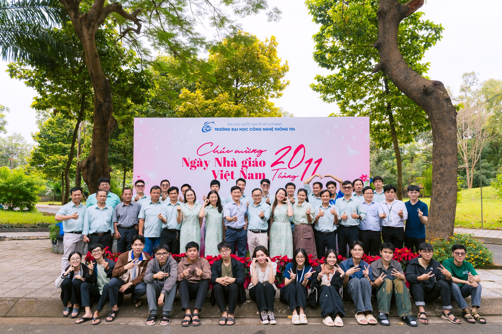
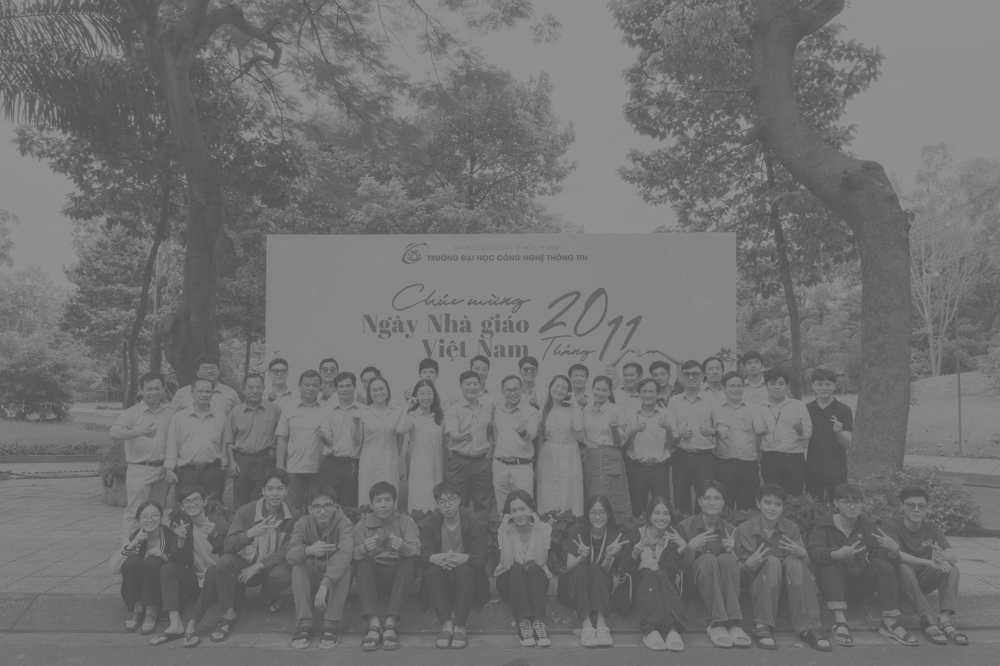

# Verilog RGB-to-Grayscale Image Converter
# Note: You should not synthesize this code because it is not designed for running on FPGA, but rather for functional verification purposes
# Using Modelsim.

This project converts a full-color RGB image into an 8-bit grayscale image using a Verilog RTL module and ModelSim/QuestaSim functional simulation.

The workflow uses Python to convert the source image into hexadecimal RGB pixels, Verilog to process one pixel per valid clock cycle, and Python to reconstruct the grayscale output image.

> **Scope:** This repository is intended for functional simulation and educational use. The file-based testbench is not synthesizable and is not designed for direct FPGA deployment.

---

## Result

| Original RGB image | Verilog grayscale output |
|---|---|
|  |  |

Current image configuration:

| Property | Value |
|---|---:|
| Width | 2048 pixels |
| Height | 1365 pixels |
| Total pixels | 2,795,520 |
| Input format | 24-bit RGB |
| Output format | 8-bit grayscale |
| Simulation clock | 100 MHz |
| RTL latency | 1 clock cycle |

---

## Processing Flow

```text
baitap2_anhgoc.jpg
        │
        ▼
baitap2_rgb_to_txt.py
        │
        ▼
baitap2_pic_input.txt
   one R G B pixel per line
        │
        ▼
Lab2_bai2.v
        │
        ▼
tb_Lab2_bai2.v
        │
        ▼
ModelSim / QuestaSim
        │
        ▼
baitap2_pic_output.txt
   one grayscale value per line
        │
        ▼
baitap2_txt_to_gray.py
        │
        ▼
baitap2_grayscale.jpg
```

---

## Grayscale Conversion

The intended grayscale equation is:

```text
Y = 0.299R + 0.587G + 0.114B
```

The RTL replaces floating-point multiplication with fixed-point integer coefficients:

```text
Y ≈ (77R + 150G + 29B + 128) / 256
```

The coefficients add up to 256:

```text
77 + 150 + 29 = 256
```

This allows division by 256 to be implemented as a bit shift rather than a hardware divider.

### Brightness control

In the current main implementation, `brightness` is an unsigned value added directly to the grayscale result:

```text
gray_final = clamp(gray_base + brightness, 0, 255)
```

Examples:

```text
brightness = 0    → no additional brightness
brightness = 40   → add 40 to every grayscale pixel
brightness = 80   → add 80 to every grayscale pixel
```

Values greater than 255 are saturated to 255.

The brightness value used for full-image simulation is configured in `tb_Lab2_bai2.v`:

```verilog
brightness = 8'd80;
```

---

## Repository Structure

```text
Verilog-RGB-to-Grayscale/
├── Lab2_bai2.v
├── tb_Lab2_bai2.v
├── Lab2_Bai2_test.v
├── TB_Lab2_Bai2_test.v
├── baitap2_rgb_to_txt.py
├── baitap2_txt_to_gray.py
├── baitap2_anhgoc.jpg
├── baitap2_grayscale.jpg
├── requirements.txt
├── .gitignore
└── README.md
```

### Main files

| File | Description |
|---|---|
| `Lab2_bai2.v` | Main RGB-to-grayscale RTL module |
| `tb_Lab2_bai2.v` | Full-image file-based testbench |
| `baitap2_rgb_to_txt.py` | Converts the RGB image into hexadecimal pixel data |
| `baitap2_txt_to_gray.py` | Reconstructs the grayscale image from simulator output |
| `baitap2_anhgoc.jpg` | Original RGB source image |
| `baitap2_grayscale.jpg` | Reconstructed grayscale result |

The files ending in `_test.v` are separate verification/reference versions. Do not compile them together with the main implementation because both sets declare the same module names.

---
